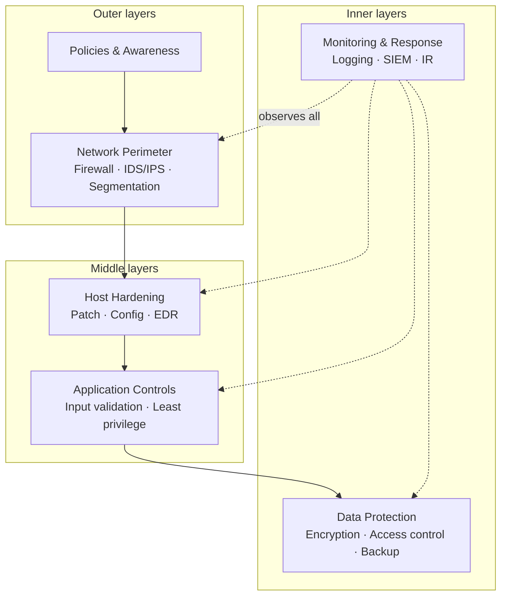

# Diagrams

CHEMDReader renders fenced Mermaid blocks as interactive SVG diagrams in the document view.

```mermaid
flowchart TB
    subgraph Outer["Outer layers"]
        P[Policies & Awareness]
        N[Network Perimeter<br/>Firewall · IDS/IPS · Segmentation]
    end
    subgraph Mid["Middle layers"]
        H[Host Hardening<br/>Patch · Config · EDR]
        A[Application Controls<br/>Input validation · Least privilege]
    end
    subgraph Inner["Inner layers"]
        D[Data Protection<br/>Encryption · Access control · Backup]
        M[Monitoring & Response<br/>Logging · SIEM · IR]
    end
    P --> N --> H --> A --> D
    M -.->|observes all| N
    M -.-> H
    M -.-> A
    M -.-> D
```
